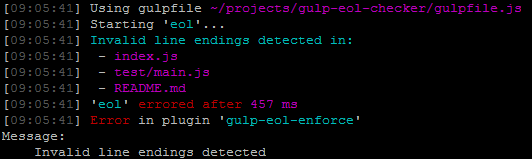

# gulp-eol-enforce

[](https://travis-ci.org/colinodell/gulp-eol-enforce)
[](https://www.npmjs.com/package/gulp-eol-enforce)

[](LICENSE)
[](https://www.npmjs.com/package/gulp-eol-enforce)

Checks line endings to ensure they're the proper type.  This plugin will fail if undesired line endings are found.  Particularly useful as a pre-commit hook.

## Usage

```js
eol(desiredNewLine)
```

`desiredNewLine` can be one of the following strings:

 - `"\n"`
 - `"\r\n"`
 - `"\r"`

This parameter defaults to your platform's default line ending (`os.EOL`).

Use this in your Gulpfile.js like so:

```js
var eol = require('gulp-eol-enforce');

gulp.task('eol', function () {
  return gulp.src(['src/**/*.{css,js}'])
    .pipe(eol('\n'));
});
```

Example output:



## Automatic Correction

This plugin **does not** automatically fix line endings - use [gulp-eol](https://www.npmjs.com/package/gulp-eol) or [gulp-line-ending-corrector](https://www.npmjs.com/package/gulp-line-ending-corrector) instead.
